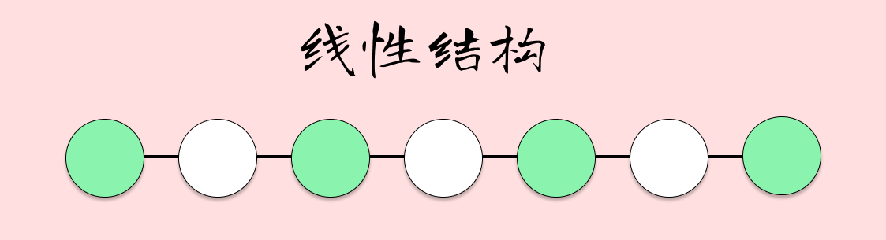

在开始讲数组之前，我们先普及一些数据结构的概念知识。

根据[百度百科](https://baike.baidu.com/item/%E6%95%B0%E6%8D%AE%E7%BB%93%E6%9E%84/1450),我们得知**数据结构是计算机存储、组织数据的方式。**

这里面有两个关键字。

一个是**存储**，我们可以理解为**物理结构**，指数据在计算机中的存储形式。

一个是**存储**，我们可以理解为**逻辑结构**，指数据对象中数据之间的互相关系。

## 逻辑结构

逻辑结构指数据对象中数据之间的互相关系。

1. 集合结构

集合结构中的数据元素处理同属于一个集，它们之间没有其他关系。各个数据元素是“平等”的，它们的共同属性是“同属于一个集合”。数据结构中的集合关系就类似于数学中的集合。

2. 线性结构（线性表）

线性结构中的数据元素之间是一对一的关系。

线性结构也称为**线性表**。顾名思义，线性表就是数据排成像一条线一样的结构。每个线性表上的数据最多只有前和后两个方向。数组、链表、队列、栈等都是线性表结构。

?> 该图片来源于：[https://time.geekbang.org/column/article/40961?utm_campaign=guanwang&utm_source=baidu-ad&utm_medium=ppzq-pc&utm_content=title&utm_term=baidu-ad-ppzq-title](https://time.geekbang.org/column/article/40961?utm_campaign=guanwang&utm_source=baidu-ad&utm_medium=ppzq-pc&utm_content=title&utm_term=baidu-ad-ppzq-title)

3. 树形结构（非线性表）
4. 图形结构（非线性表）

## 物理结构

物理结构是指数据的逻辑结构在计算机中的存储形式。

1. 顺序存储结构

是指数据元素存放在**地址连续的存储单元**里,重点是连续的存储空间。

2. 链式存储结构

链式存储中，逻辑上相邻的数据元素，**物理存储位置不一定相邻**，使用**指针**实现元素之间的逻辑关系。

