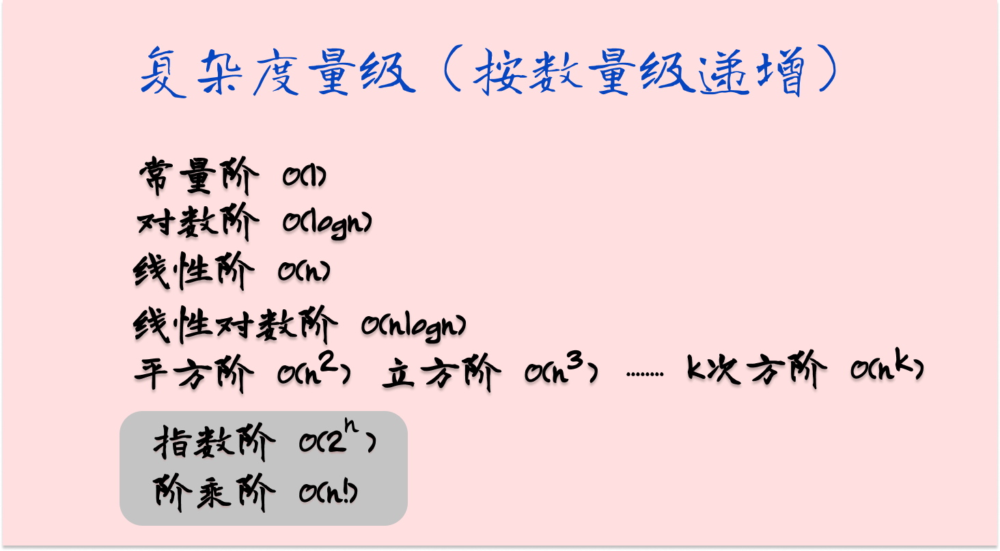
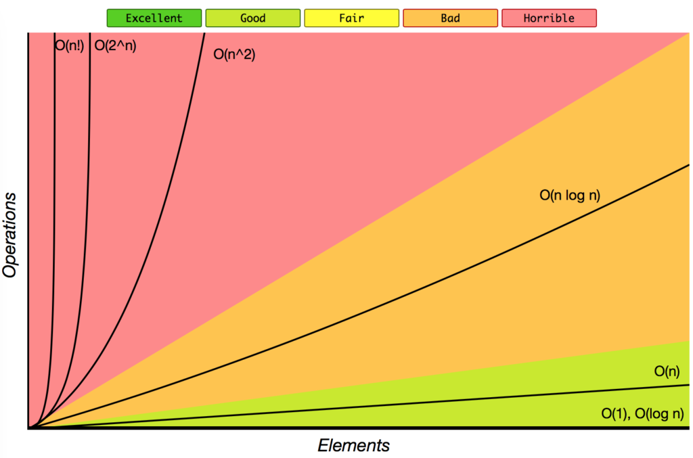

众所周知，**数据结构和算法是为了让代码运行得更快，更省存储空间**。那么，怎么评估代码的速度和存储空间呢？这就是本节所讲的内容，时间、空间复杂度分析。

## 大 O 复杂度表示法

算法的执行效率，粗略地讲，就是算法代码执行的时间。但是，如何在不运行代码的情况下，用“肉眼”得到一段代码的执行时间呢？

这里有段非常简单的代码，求 1,2,3…n 的累加和。现在，我就带你一块来估算一下这段代码的执行时间。

```java
int cal(int n) {
   int sum = 0;
   int i = 1;
   for (; i <= n; ++i) {
     sum = sum + i;
   }
   return sum;
 }
```

假设每行代码执行的时间都一样，为 unitTime。那么这段代码的总执行时间是多少呢？
第 2、3 行代码分别需要 1 个 unitTime 的执行时间，第 4、5 行都运行了 n 遍，所以需要$2n*unitTime$的执行时间，所以这段代码总的执行时间就是 $(2n+2)*unitTime$。

按照这个分析思路，我们再来看这段代码。
```java
 int cal(int n) {
   int sum = 0;
   int i = 1;
   int j = 1;
   for (; i <= n; ++i) {
     j = 1;
     for (; j <= n; ++j) {
       sum = sum +  i * j;
     }
   }
 }
```
我们依旧假设每个语句的执行时间是 unitTime。那这段代码的总执行时间 T(n) 是多少呢？

第 2、3、4 行代码，每行都需要 1 个 unitTime 的执行时间，第 5、6 行代码循环执行了 n 遍，需要 $2n * unitTime $的执行时间，第 7、8 行代码循环执行了 $n^2$遍，所以需要 $2n^2 * unitTime$ 的执行时间。所以，整段代码总的执行时间为$$T(n) = (2n^2+2n+3)*unitTime$$

通过上面的计算我们可以发现，**所有代码的执行时间 T(n) 与每行代码的执行次数 n 成正比。**

我们可以把这个规律总结成一个公式。注意，大 O 就要登场了！

$$T(n) = O(f(n))$$

其中，$T(n)$ 表示代码执行的时间；n 表示数据规模的大小；$f(n)$ 表示每行代码执行的次数总和。因为这是一个公式，所以用 $f(n)$ 来表示。公式中的 O，表示代码的执行时间 $T(n)$ 与 $f(n)$ 表达式成正比。

所以，第一个例子中的 $T(n) = O(2n+2)$，第二个例子中的 $T(n) = O(2n^2+2n+3)$。这就是**大 O 时间复杂度表示法**。大 O 时间复杂度实际上并不具体表示代码真正的执行时间，而是表示**代码执行时间随数据规模增长的变化趋势**，所以，也叫作**渐进时间复杂度（asymptotic time complexity）**，简称**时间复杂度**。

当 n 很大时，你可以把它想象成 10000、100000。而公式中的低阶、常量、系数三部分并不左右增长趋势，所以都可以忽略。我们只需要记录一个最大量级就可以了，如果用大 O 表示法表示刚讲的那两段代码的时间复杂度，就可以记为：$T(n) = O(n)$； $T(n) = O(n^2)$。

## 时间复杂度分析

前面介绍了大 O 复杂度表示法，接下来分享3条分析技巧，帮助大家快速的对代码进行时间复杂度分析。

### 关注循环执行次数最多的一段代码

通过上面的内容，我们知道大 O 复杂度表示方法只是表示一种变化趋势，**而常量、低阶和系数并不会影响变化趋势，所以只需要记录一个最大阶的量级就可以**。所以我们在分析时间复杂度的时候，只关注循环次数最多的一段代价就可以。

我们根据这个原则分析一下上面提到的两个例子。


实例1
```java
int cal(int n) {
   int sum = 0;
   int i = 1;
   for (; i <= n; ++i) {
     sum = sum + i;
   }
   return sum;
 }
```
不难发现，这段代码循环最多的一段代码为第4、第5行，分别执行了n次，去掉系数即可得出时间复杂度为$O(n)$。

实例2
```java
 int cal(int n) {
   int sum = 0;
   int i = 1;
   int j = 1;
   for (; i <= n; ++i) {
     j = 1;
     for (; j <= n; ++j) {
       sum = sum +  i * j;
     }
   }
 }
```
这里也不难发现，循环最多的是第7、第8行，分别执行了$n^2$次，去掉系数即可得出时间复杂度为$O(n^2)$。

### 加法法则：总复杂度等于最大的代码块的复杂度
这里，我们先一起分析一下下面的代码
```java
int sum(int n) {
   int sum_1 = 0;
   int p = 1;
   for (; p < 100; ++p) {
     sum_1 = sum_1 + p;
   }

   int sum_2 = 0;
   int q = 1;
   for (; q < n; ++q) {
     sum_2 = sum_2 + q;
   }
 
   int sum_3 = 0;
   int i = 1;
   int j = 1;
   for (; i <= n; ++i) {
     j = 1; 
     for (; j <= n; ++j) {
       sum_3 = sum_3 +  i * j;
     }
   }
 
   return sum_1 + sum_2 + sum_3;
 }
```
这个代码分为三部分，分别是求 sum_1、sum_2、sum_3。我们可以分别分析每一部分的时间复杂度，然后把它们放到一块儿，再取一个量级最大的作为整段代码的复杂度。

这里我们可以很容易的分析出三段代码的复杂度，分别是$O(1)$,$O(n)n$,$O(n^2)$。我们取其中最大的量级。所以，整段代码的时间复杂度就为 $O(n^2)$。

也就是说：**总的时间复杂度就等于量级最大的那段代码的时间复杂度**。那我们将这个规律抽象成公式就是：

如果 $T1(n)=O(f(n))$，$T2(n)=O(g(n))$；那么 $T(n)=T1(n)+T2(n)=max(O(f(n))$, $O(g(n))) =O(max(f(n), g(n)))$。

?>  其实我们也可以根据**关注循环执行次数最多的一段代码**这条法则进行分析，分析发现循环次数最多的代码是第19、第20行代码，去除系数得到时间复杂度为$O(n^2)$

### 乘法法则：嵌套代码复杂度等于嵌套内外代码复杂度乘积
这里还是直接上代码进行分析

```java
int cal(int n) {
   int ret = 0; 
   int i = 1;
   for (; i < n; ++i) {
     ret = ret + f(i);
   } 
 } 
 
 int f(int n) {
  int sum = 0;
  int i = 1;
  for (; i < n; ++i) {
    sum = sum + i;
  } 
  return sum;
 }
```
首先分析cal()方法（这里把f()当作一个普通的操作），不难分析出cal()方法的时间复杂度为$O(n)$，记为$T_1(n) = O(n)$ 。接下来分析f()方法，也不难看出时间复杂度为$O(n)$,记为$T_2(n) = O(n)$。然后发现cal()方法的循环里面内嵌了f()方法，所以整段代码的时间复杂度为$O(n^2)$。即
$$T(n) = T_1(n) * T_2(n) = O(n*n) = O(n^2)$$

我们将这个规律抽象成公式就是

如果 $T_1(n)=O(f(n))$，$T_2(n)=O(g(n))$；那么 $T(n)=T_1(n)*T_2(n)=O(f(n))*O(g(n))=O(f(n)*g(n))$。
## 几种常见时间复杂度实例分析 

虽然代码千差万别，但是常见的复杂度量级并不多。我稍微总结了一下，这些复杂度量级几乎涵盖了你今后可以接触的所有代码的复杂度量级。




对于刚罗列的复杂度量级，我们可以粗略地分为两类，**多项式量级**和**非多项式量级**。其中，非多项式量级只有两个：$O(2^n)$ 和 $O(n!)$。我们把时间复杂度为非多项式量级的算法问题叫作 NP（Non-Deterministic Polynomial，非确定多项式）问题。当数据规模 n 越来越大时，非多项式量级算法的执行时间会急剧增加，求解问题的执行时间会无限增长。所以，非多项式时间复杂度的算法其实是非常低效的算法。在这里就不多做赘述。

接下来我们看几种常见的多项式时间复杂度：

### $O(1)$ {docsify-ignore}
只要代码的执行时间不随 n 的增大而增长，这样代码的时间复杂度我们都记作 $O(1)$。

接下来举个例子。我们依旧假设每个语句的执行时间是 unitTime

实例1
```java
 int i = 8;
 int j = 6;
 int sum = i + j;
```
假设该段代码不论在什么情况下，执行时间都是$3*unitTime$，所以记作$O(1)$。

### O(logn) {docsify-ignore}
对数阶时间复杂度非常常见，同时也是最难分析的一种时间复杂度。我通过一个例子来说明一下。

```java
 i=1;
 while (i <= n)  {
   i = i * 2;
 }
```

根据**关注循环执行次数最多的一段代码**法则，我们发现执行最多的代码是第三行。所以我们只需要计算出这行代码被执行了多少次，就能知道整段代码的时间复杂度。

从代码中可以看出，变量 i 的值从 1 开始取，每循环一次就乘以 2。当大于 n 时，循环结束。还记得我们高中学过的等比数列吗？实际上，变量 i 的取值就是一个等比数列。如果我把它一个一个列出来，就应该是这个样子的：


所以，我们只要知道 x 值是多少，就知道这行代码执行的次数了。通过 $2^x=n$ 求解 x 这个问题我们想高中应该就学过了，我就不多说了。$x=log_2n$，所以，这段代码的时间复杂度就是 $O(log_2n)$。

现在，我把代码稍微改下，你再看看，这段代码的时间复杂度是多少？

```java
 i=1;
 while (i <= n)  {
   i = i * 3;
 }
```

根据我刚刚讲的思路，很简单就能看出来，这段代码的时间复杂度为 $O(log_3n)$。

实际上，不管是以 2 为底、以 3 为底，还是以 10 为底，我们可以把所有对数阶的时间复杂度都记为 $O(logn)$。为什么呢？我们知道，对数之间是可以互相转换的，$log_3n$ 就等于 $log_32 * log_2n$，所以 $O(log_3n) = O(C * log_2n)$，其中 $C=log_32 $是一个常量。通过前面的学习，我们知道可以忽略系数，因此，在对数阶时间复杂度的表示方法里，我们忽略对数的“底”，统一表示为 $O(logn)$。

?> 如果你理解了 O(logn)，那 O(nlogn) 就很容易理解了。还记得刚讲的乘法法则吗？如果一段代码的时间复杂度是 O(logn)，我们循环执行 n 遍，时间复杂度就是 O(nlogn) 了。

### O(n) {docsify-ignore}
一般含有非嵌套循环。线性阶就是随着问题规模n的扩大，对应计算次数呈直线增长。
```java
int i , n = 100, sum = 0;
for( i=0; i < n; i++ )
{
    sum = sum + i;
}
```


### $O(n^2)$ {docsify-ignore}
基本上含有两层for循环。随着问题规模n的扩大，对应计算次数呈平方数增长。
```java
for (int i = 0; i < n; i++) { 
  for (int j = 0; j < n; j++) { 
     print('I am here!'); 
  }
}
```
?> **同理**，$O(n^3)$基本上就是含有三层for循环，不再赘述。

### $O(m+n)$、$O(m*n)$ {docsify-ignore}
这种情况通常是由两个数据的规模来决定，不再是单纯的一个n。
```java
int cal(int m, int n) {
  int sum_1 = 0;
  int i = 1;
  for (; i < m; ++i) {
    sum_1 = sum_1 + i;
  }

  int sum_2 = 0;
  int j = 1;
  for (; j < n; ++j) {
    sum_2 = sum_2 + j;
  }

  return sum_1 + sum_2;
}
```

从代码中可以看出，m 和 n 是表示两个数据规模。我们无法评估 m 和 n 谁的量级大，所以我们在表示复杂度的时候，就不能简单地利用加法法则，省略掉其中一个。所以，上面代码的时间复杂度就是 $O(m+n)$。

?>  $O(m*n)$同理。

### 总结 {docsify-ignore}
为了更好的对比速度，我从网上找到了这种图片，时间复杂度的好坏一目了然。



?> 该图片来源于：[https://learntocodetogether.com/big-o-cheat-sheet-for-common-data-structures-and-algorithms/](https://learntocodetogether.com/big-o-cheat-sheet-for-common-data-structures-and-algorithms/)

**看图可以总结出，$O(1)$、$O(logn)$是优秀的算法，$O(n)$也可以接受。在写算法的时候，要优先考虑时间复杂度为这三种的算法。**

## 最好、最坏情况时间复杂度

上面给出的例子都比较简单的，接下来我给出一个比较复杂的例子，大家分析一下。
```java
public int find(int[] arr, int target) {
    int n = arr.length;
    for (int i = 0; i < n; i++) {
        if (arr[i] == target) {
            return i;
        }
    }
    return -1;
}
```
这段代码的意思显而易见，是在数组中寻找指定的值，依次遍历数组，如果找到和目标值相同的值，在返回该值所在下标。

可以发现，该段代码的时间复杂度不是简简单单的$O(n)$，因为目标元素在数组中位置的不同导致时间复杂度的不同。

要查找的变量 x 可能出现在数组的任意位置。如果数组中第一个元素正好是要查找的变量 x，那就不需要继续遍历剩下的 n-1 个数据了，那时间复杂度就是 O(1)。但如果数组中不存在变量 x，那我们就需要把整个数组都遍历一遍，时间复杂度就成了 O(n)。所以，不同的情况下，这段代码的时间复杂度是不一样的。

为了表示代码在不同情况下的不同时间复杂度，我们需要引入三个概念：**最好情况时间复杂度、最坏情况时间复杂度和平均情况时间复杂度。**

所以。

**最好情况时间复杂度：目标元素刚好在数组第一个位置，那么只需要一次就能找到，时间复杂度很明显是常量阶O(1)。**

**最坏情况时间复杂度：目标元素在数组最后一个位置或者不在数组中，那么得需要遍历完整个数组才能得出结果，时间复杂度为O(n)。**


## 平均情况时间复杂度

最好和最好情况是极端情况，发生的概率并不大。为了更有效的表示平均情况下的时间复杂度，引入另一个概念：平均情况时间复杂度。

分析上面的示例代码，判断target在循环中出现的位置，有n+1种情况：target在数组中的n中情况和target不在数组中的一种情况。

我们将所有情况下代码执行的次数累加起来$(1+2+3....+n)+n$，然后再除以所有情况数量$n+1$，就可以得到需要遍历次数的平均值。

$$\frac{(1+2+3....+n)+n}{n+1} = \frac{n(n+3)}{2(n+1)}$$

推导过程：

根据**高斯算法**，我们知道，$1+2+3+……+n = \frac{n*(n+1)}{2}$
$$∴(1+2+3+……+n) + n = \frac{n*(n+1)}{2} + n = \frac{n*(n+3)}{2} $$
$$∴\frac{(1+2+3....+n)+n}{n+1} = \frac{n*(n+3)}{2} ÷ (n+1) = \frac{n(n+3)}{2(n+1)} $$

根据上面所学内容知道，省略系数、低阶、常量，所以平均情况时间复杂度是O(n)。

结果虽然是正确的，但是我们忽略了一个重要的问题，那就是概率问题，即刚才所述的n+1中情况，出现的概率并不是一样的。我们知道，要查找的变量 target，要么在数组里，要么就不在数组里。所以它们的概率是$\frac{1}{2}$。

同时数据在1-n中各个位置的概率都是一样的为$\frac{1}{n}$。故当数据在1-n中时的概率为$\frac{1}{2*n}$，不在1-n中时的概率为$\frac{1}{2}$。

所以，考虑概率的平均情况复杂度为：
$$(1*\frac{1}{2n}+2*\frac{1}{2n}+3*\frac{1}{2n}+……+n*\frac{1}{2n})+ n* \frac{1}{2n} = \frac{3n+1}{4}$$

推导过程：

根据**高斯算法**，我们知道，$1+2+3+……+n = \frac{n*(n+1)}{2}$
$$∴ (1*\frac{1}{2n}+2*\frac{1}{2n}+3*\frac{1}{2n}+……+n*\frac{1}{2n}) = \frac{1}{2n}*(1+2+3+……+n) $$
$$∴ \frac{1}{2n}*(1+2+3+……+n) = \frac{1}{2n}* \frac{n*(n+1)}{2} = \frac{1+n}{4}$$
$$∴ (1*\frac{1}{2n}+2*\frac{1}{2n}+3*\frac{1}{2n}+……+n*\frac{1}{2n})+ n* \frac{1}{2n} = \frac{1+n}{4} + n*\frac{1}{2} = \frac{3n+1}{4}$$

省略系数、低阶、常量，时间复杂度还是O(n)。

这个值就是概率论中的加权平均值，也叫作期望值，所以平均时间复杂度的全称应该叫加权平均时间复杂度或者期望时间复杂度。

?> 在大多数情况下，我们并不需要区分最好、最坏、平均情况时间复杂度三种情况,只有同一块代码在不同的情况下，时间复杂度有量级的差距，我们才会使用这三种复杂度表示法来区分。

## 均摊时间复杂度


## 空间复杂度分析

接下来我们讲空间复杂度分析。如果能够理解时间复杂度分析，那空间复杂度分析对你就小菜一碟了。

时间复杂度的全称是渐进时间复杂度，表示算法的执行时间与数据规模之间的增长关系。类比一下，**空间复杂度全称就是渐进空间复杂度**（asymptotic space complexity），**表示算法的存储空间与数据规模之间的增长关系。**

```java
void print(int n) {
  int i = 0;
  int[] a = new int[n];
  for (i; i <n; ++i) {
    a[i] = i * i;
  }

  for (i = n-1; i >= 0; --i) {
    print out a[i]
  }
}
```

跟时间复杂度分析一样，我们可以看到，第 2 行代码中，我们申请了一个空间存储变量 i，但是它是常量阶的，跟数据规模 n 没有关系，所以我们可以忽略。第 3 行申请了一个大小为 n 的 int 类型数组，除此之外，剩下的代码都没有占用更多的空间，所以整段代码的空间复杂度就是 O(n)。

?> 我们常见的空间复杂度就是 O(1)、O(n)、$O(n^2)$，像 O(logn)、O(nlogn) 这样的对数阶复杂度平时都用不到。所以，对于空间复杂度，掌握刚我说的这些内容已经足够了。


## Reference

!> **[数据结构与算法之美-王峥](https://time.geekbang.org/column/intro/126?utm_campaign=guanwang&utm_source=baidu-ad&utm_medium=ppzq-pc&utm_content=title&utm_term=baidu-ad-ppzq-title)**