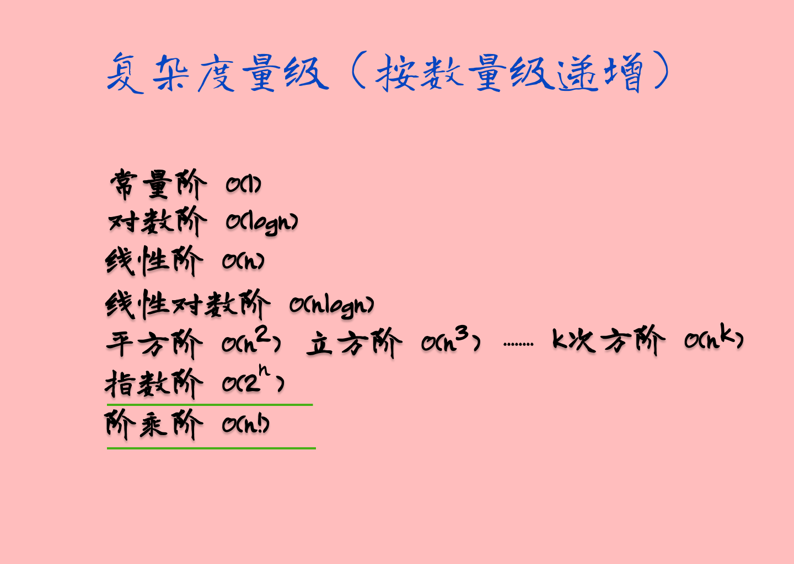

# 复杂度分析

众所周知，**数据结构和算法是为了让代码运行得更快，更省存储空间**。那么，怎么评估代码的速度和存储空间呢？这就是本节所讲的内容，时间、空间复杂度分析。

## 大 O 复杂度表示法

!> 该部分内容参照**[极客时间-数据结构与算法之美-王峥](https://time.geekbang.org/column/intro/126?utm_campaign=guanwang&utm_source=baidu-ad&utm_medium=ppzq-pc&utm_content=title&utm_term=baidu-ad-ppzq-title)**

算法的执行效率，粗略地讲，就是算法代码执行的时间。但是，如何在不运行代码的情况下，用“肉眼”得到一段代码的执行时间呢？

这里有段非常简单的代码，求 1,2,3…n 的累加和。现在，我就带你一块来估算一下这段代码的执行时间。

```java
int cal(int n) {
   int sum = 0;
   int i = 1;
   for (; i <= n; ++i) {
     sum = sum + i;
   }
   return sum;
 }
```

假设每行代码执行的时间都一样，为 unitTime。那么这段代码的总执行时间是多少呢？
第 2、3 行代码分别需要 1 个 unitTime 的执行时间，第 4、5 行都运行了 n 遍，所以需要$2n*unitTime$的执行时间，所以这段代码总的执行时间就是 $(2n+2)*unitTime$。

按照这个分析思路，我们再来看这段代码。
```java
 int cal(int n) {
   int sum = 0;
   int i = 1;
   int j = 1;
   for (; i <= n; ++i) {
     j = 1;
     for (; j <= n; ++j) {
       sum = sum +  i * j;
     }
   }
 }
```
我们依旧假设每个语句的执行时间是 unitTime。那这段代码的总执行时间 T(n) 是多少呢？

第 2、3、4 行代码，每行都需要 1 个 unitTime 的执行时间，第 5、6 行代码循环执行了 n 遍，需要 $2n * unitTime $的执行时间，第 7、8 行代码循环执行了 $n^2$遍，所以需要 $2n^2 * unitTime$ 的执行时间。所以，整段代码总的执行时间为$$T(n) = (2n^2+2n+3)*unitTime$$

通过上面的计算我们可以发现，**所有代码的执行时间 T(n) 与每行代码的执行次数 n 成正比。**

我们可以把这个规律总结成一个公式。注意，大 O 就要登场了！

$$T(n) = O(f(n))$$

其中，$T(n)$ 表示代码执行的时间；n 表示数据规模的大小；$f(n)$ 表示每行代码执行的次数总和。因为这是一个公式，所以用 $f(n)$ 来表示。公式中的 O，表示代码的执行时间 $T(n)$ 与 $f(n)$ 表达式成正比。

所以，第一个例子中的 $T(n) = O(2n+2)$，第二个例子中的 $T(n) = O(2n^2+2n+3)$。这就是**大 O 时间复杂度表示法**。大 O 时间复杂度实际上并不具体表示代码真正的执行时间，而是表示**代码执行时间随数据规模增长的变化趋势**，所以，也叫作**渐进时间复杂度（asymptotic time complexity）**，简称**时间复杂度**。

当 n 很大时，你可以把它想象成 10000、100000。而公式中的低阶、常量、系数三部分并不左右增长趋势，所以都可以忽略。我们只需要记录一个最大量级就可以了，如果用大 O 表示法表示刚讲的那两段代码的时间复杂度，就可以记为：$T(n) = O(n)$； $T(n) = O(n^2)$。

## 时间复杂度分析

前面介绍了大 O 复杂度表示法，接下来分享3条分析技巧，帮助大家快速的对代码进行时间复杂度分析。

### 关注循环执行次数最多的一段代码

通过上面的内容，我们知道大 O 复杂度表示方法只是表示一种变化趋势，**而常量、低阶和系数并不会影响变化趋势，所以只需要记录一个最大阶的量级就可以**。所以我们在分析时间复杂度的时候，只关注循环次数最多的一段代价就可以。

我们根据这个原则分析一下上面提到的两个例子。


实例1
```java
int cal(int n) {
   int sum = 0;
   int i = 1;
   for (; i <= n; ++i) {
     sum = sum + i;
   }
   return sum;
 }
```
不难发现，这段代码循环最多的一段代码为第4、第5行，分别执行了n次，去掉系数即可得出时间复杂度为$O(n)$。

实例2
```java
 int cal(int n) {
   int sum = 0;
   int i = 1;
   int j = 1;
   for (; i <= n; ++i) {
     j = 1;
     for (; j <= n; ++j) {
       sum = sum +  i * j;
     }
   }
 }
```
这里也不难发现，循环最多的是第7、第8行，分别执行了$n^2$次，去掉系数即可得出时间复杂度为$O(n^2)$。

### 加法法则：总复杂度等于最大的代码块的复杂度
这里，我们先一起分析一下下面的代码
```java
int sum(int n) {
   int sum_1 = 0;
   int p = 1;
   for (; p < 100; ++p) {
     sum_1 = sum_1 + p;
   }

   int sum_2 = 0;
   int q = 1;
   for (; q < n; ++q) {
     sum_2 = sum_2 + q;
   }
 
   int sum_3 = 0;
   int i = 1;
   int j = 1;
   for (; i <= n; ++i) {
     j = 1; 
     for (; j <= n; ++j) {
       sum_3 = sum_3 +  i * j;
     }
   }
 
   return sum_1 + sum_2 + sum_3;
 }
```
这个代码分为三部分，分别是求 sum_1、sum_2、sum_3。我们可以分别分析每一部分的时间复杂度，然后把它们放到一块儿，再取一个量级最大的作为整段代码的复杂度。

这里我们可以很容易的分析出三段代码的复杂度，分别是$O(1)$,$O(n)n$,$O(n^2)$。我们取其中最大的量级。所以，整段代码的时间复杂度就为 $O(n^2)$。

也就是说：**总的时间复杂度就等于量级最大的那段代码的时间复杂度**。那我们将这个规律抽象成公式就是：

如果 $T1(n)=O(f(n))$，$T2(n)=O(g(n))$；那么 $T(n)=T1(n)+T2(n)=max(O(f(n))$, $O(g(n))) =O(max(f(n), g(n)))$。

?> **注意** 其实我们也可以根据**关注循环执行次数最多的一段代码**这条法则进行分析，分析发现循环次数最多的代码是第19、第20行代码，去除系数得到时间复杂度为$O(n^2)$

### 乘法法则：嵌套代码复杂度等于嵌套内外代码复杂度乘积
这里还是直接上代码进行分析

```java
int cal(int n) {
   int ret = 0; 
   int i = 1;
   for (; i < n; ++i) {
     ret = ret + f(i);
   } 
 } 
 
 int f(int n) {
  int sum = 0;
  int i = 1;
  for (; i < n; ++i) {
    sum = sum + i;
  } 
  return sum;
 }
```
首先分析cal()方法（这里把f()当作一个普通的操作），不难分析出cal()方法的时间复杂度为$O(n)$，记为$T_1(n) = O(n)$ 。接下来分析f()方法，也不难看出时间复杂度为$O(n)$,记为$T_2(n) = O(n)$。然后发现cal()方法的循环里面内嵌了f()方法，所以整段代码的时间复杂度为$O(n^2)$。即
$$T(n) = T_1(n) * T_2(n) = O(n*n) = O(n^2)$$

我们将这个规律抽象成公式就是

如果 $T_1(n)=O(f(n))$，$T_2(n)=O(g(n))$；那么 $T(n)=T_1(n)*T_2(n)=O(f(n))*O(g(n))=O(f(n)*g(n))$。
## 几种常见时间复杂度实例分析

